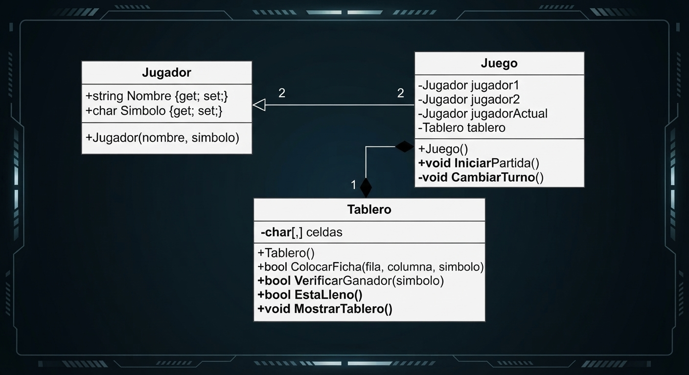
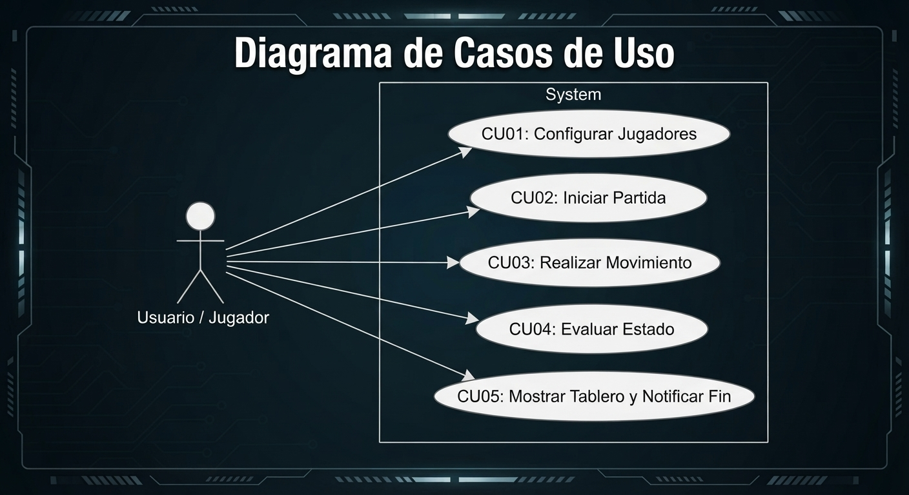
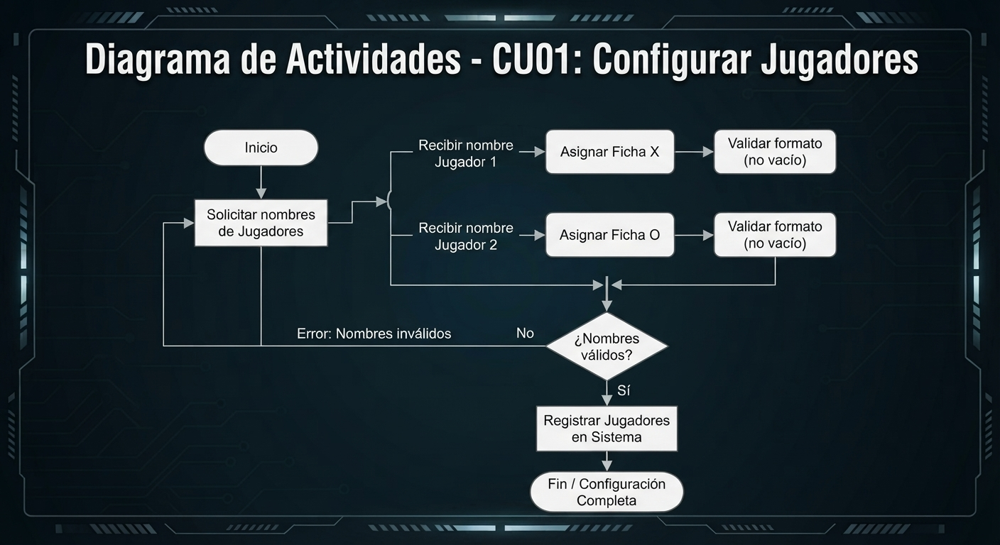

# 🎮 Prototipo de Sistema: 3 en Raya (Tic-Tac-Toe) en C# / .NET

Prototipo de consola desarrollado bajo estrictos principios de **Diseño Orientado a Objetos (DOO)** utilizando .NET y C#, evaluando competencias en análisis, diseño e implementación de sistemas de software.

---

## Sección 1: Análisis del Sistema (Casos de Uso)

A continuación se formalizan los 5 Casos de Uso (CU) principales que describen la interacción del usuario y la lógica del sistema durante la partida:

1. **CU01: Registrar / Configurar Jugadores**
   * **Actor:** Usuario / Sistema.
   * **Descripción:** El sistema solicita y registra los nombres (y asigna automáticamente los símbolos `X` y `O`) de los dos participantes antes de iniciar la partida.
2. **CU02: Iniciar / Reiniciar Partida**
   * **Actor:** Jugador / Controlador.
   * **Descripción:** Se inicializa el tablero de juego con celdas vacías y se establece el turno inicial para el primer jugador.
3. **CU03: Realizar Movimiento**
   * **Actor:** Jugador Actual.
   * **Descripción:** El jugador ingresa por consola las coordenadas (fila y columna de 0 a 2). El sistema valida que la celda se encuentre dentro de los límites y no esté previamente ocupada antes de colocar la ficha.
4. **CU04: Evaluar Estado del Juego**
   * **Actor:** Sistema (Controlador).
   * **Descripción:** Tras cada jugada, el sistema analiza la matriz del tablero para determinar si se cumple una condición de victoria (3 fichas alineadas en horizontal, vertical o diagonal) o un empate por saturación de celdas.
5. **CU05: Mostrar Tablero y Notificar Fin de Partida**
   * **Actor:** Sistema.
   * **Descripción:** El sistema renderiza visualmente el estado actualizado del tablero en la consola tras cada turno y anuncia el resultado final (ganador o empate), finalizando la ejecución.

---

## Sección 2: Diseño Orientado a Objetos (DOO)

### Arquitectura de Clases
La solución se encuentra modularizada evitando bloques monolíticos o funciones principales saturadas:
* **`Jugador` (Entidad de Usuario):** Modela la información individual del participante aplicando encapsulamiento.
* **`Tablero` (Estructura de Datos):** Encapsula la matriz bidimensional y concentra la lógica de validación de espacios, renderizado e impresión de reglas de victoria.
* **`Juego` (Controlador del Sistema):** Orquesta el flujo global de la ejecución, la alternancia de turnos y la interacción por consola.

### Diagrama de Clases UML (Modelo de Relaciones)

```text
+-------------------+       +-------------------+       +-------------------+
|     Jugador       |       |      Tablero      |       |       Juego       |
+-------------------+       +-------------------+       +-------------------+
| + Nombre: string  |       | - celdas: char[,] |       | - jugador1        |
| + Simbolo: char   |       |                   |       | - jugador2        |
+-------------------+       +-------------------+       | - jugadorActual   |
| + Jugador(...)    |       | + ColocarFicha()  |       | - tablero         |
+-------------------+       | + VerificarGanador|       +-------------------+
                            | + EstaLleno()     |       | + IniciarPartida()|
                            | + MostrarTablero()|       +-------------------+
                            +-------------------+                 |
                                                                  | (compone/usa)
                                                                  v
                                                        [ 2x Jugador & 1x Tablero ]

```


## DIAGRAMAS:






