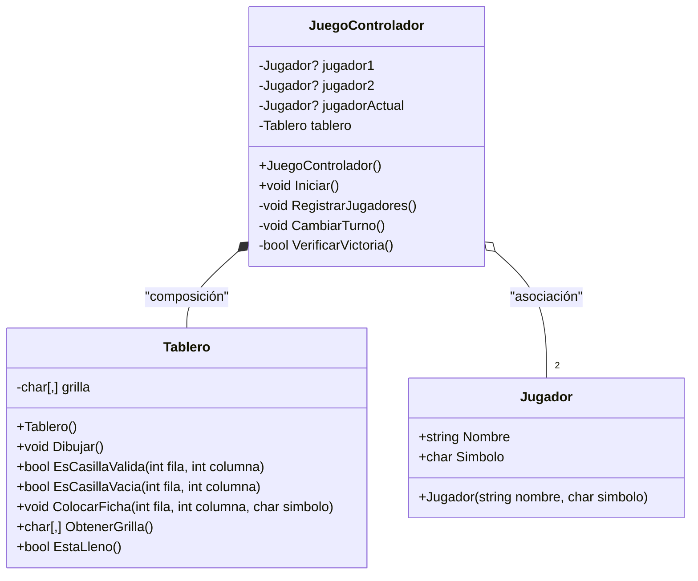

```mermaid
classDiagram
    class Jugador {
        +string Nombre
        +char Simbolo
        +Jugador(string nombre, char simbolo)
    }

    class Tablero {
        -char[,] grilla
        +Tablero()
        +void Dibujar()
        +bool EsCasillaValida(int fila, int columna)
        +bool EsCasillaVacia(int fila, int columna)
        +void ColocarFicha(int fila, int columna, char simbolo)
        +char[,] ObtenerGrilla()
        +bool EstaLleno()
    }

    class JuegoControlador {
        -Jugador? jugador1
        -Jugador? jugador2
        -Jugador? jugadorActual
        -Tablero tablero
        +JuegoControlador()
        +void Iniciar()
        -void RegistrarJugadores()
        -void CambiarTurno()
        -bool VerificarVictoria()
    }

    JuegoControlador *-- Tablero : "composición"
    JuegoControlador o-- "2" Jugador : "asociación"
```