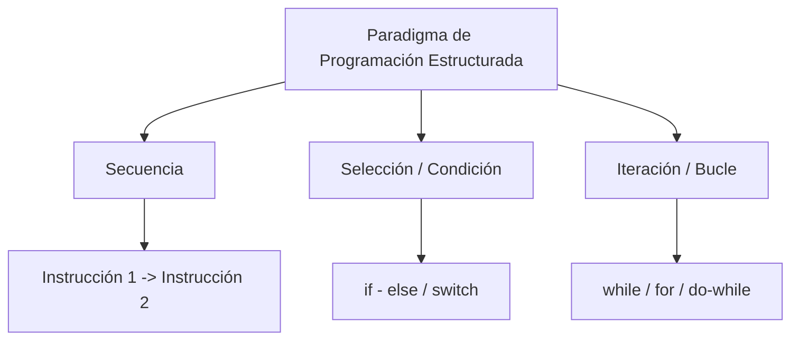
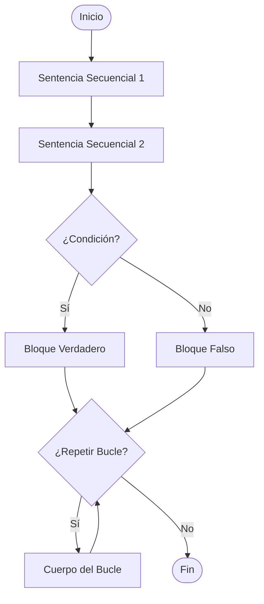
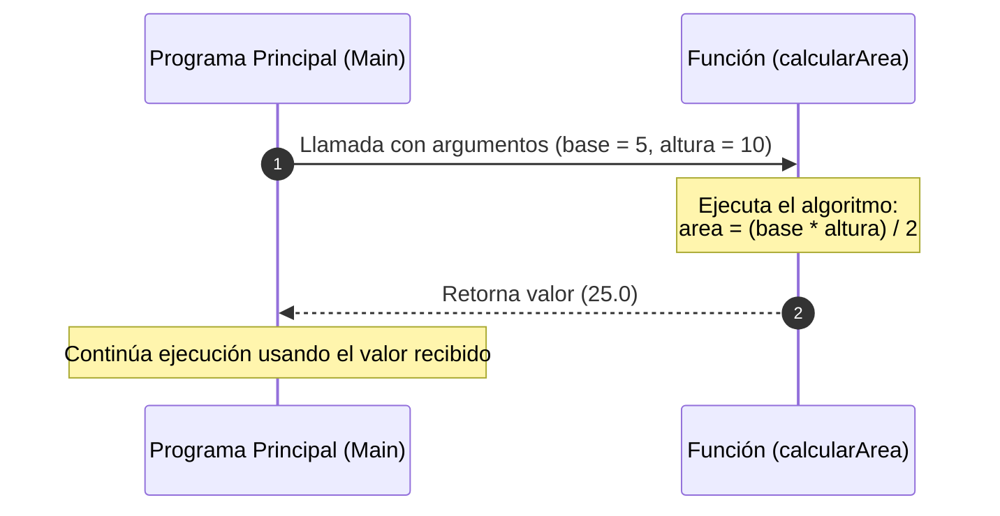
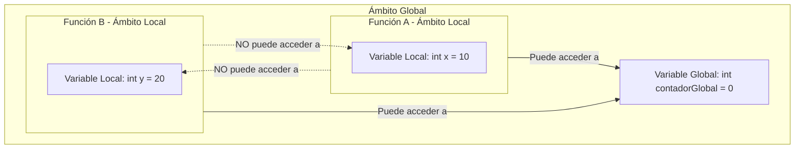

# Conceptos Fundamentales de la Programación Estructurada

Este documento ofrece un compendio teórico detallado sobre los pilares de la **Programación Estructurada**, abarcando desde los teoremas fundamentales hasta los entornos de desarrollo, estructuras de control, modularidad y buenas prácticas de desarrollo de software.

---

## 1. Introducción a la Programación Estructurada

La **Programación Estructurada** es un paradigma de programación orientado a mejorar la claridad, calidad y tiempo de desarrollo de un programa computadora mediante el uso exclusivo de subrutinas y tres estructuras de control principales: **secuencia**, **selección** e **iteración**.

### 1.1 Historia y Antecedentes
Surgió en la década de 1960, promovida principalmente por científicos de la computación como **Edsger W. Dijkstra**, **Corrado Böhm** y **Giuseppe Jacopini**. En 1968, Dijkstra publicó su famosa carta *"Go To Statement Considered Harmful"* ("La sentencia Go To considerada perjudicial"), criticando el uso indiscriminado de saltos incondicionales (`GOTO`), los cuales producían el denominado *"código espagueti"* (difícil de leer, depurar y mantener).

### 1.2 Teorema de Böhm-Jacopini
El fundamento matemático de este paradigma radica en el **Teorema del Programa Estructurado** (1966), propuesto por Corrado Böhm y Giuseppe Jacopini. Este teorema establece que:

> *Cualquier función computable o programa puede ser implementado combinando únicamente tres estructuras lógicas básicas: Secuencia, Selección y Repetición.*



### 1.3 Ventajas Principales
- **Legibilidad elevada:** Estructura lineal y jerárquica clara.
- **Mantenibilidad:** Facilidad para encontrar errores y modificar módulos sin afectar todo el sistema.
- **Facilidad de pruebas (Testing):** Al descomponer el código en funciones/módulos independientes, las pruebas unitarias son más sencillas.
- **Reducción de complejidad:** Evita saltos incondicionales arbitrarios (`GOTO`).

---

## 2. Entornos de Desarrollo Integrados (IDE)

Un **IDE** (*Integrated Development Environment*) es una aplicación software que proporciona un conjunto integral de herramientas para facilitar la programación y el desarrollo de software.

### 2.1 Componentes Principales de un IDE

1. **Editor de Código Fuente:**
   - Resaltado de sintaxis (Syntax Highlighting).
   - Autocompletado inteligente de código (IntelliSense).
   - Detección de errores sintácticos en tiempo real.
2. **Compilador / Intérprete:**
   - Herramientas integradas para traducir el código fuente a código máquina o interpretable.
3. **Depurador (Debugger):**
   - Permite ejecutar el programa paso a paso.
   - Puntos de interrupción (*Breakpoints*).
   - Inspección de variables y pila de llamadas (*Call Stack*) en tiempo de ejecución.
4. **Gestor de Construcción y Proyectos:**
   - Automatización de compilación, empaquetado y gestión de dependencias.
5. **Integración con Sistemas de Control de Versiones (VCS):**
   - Integración directa con plataformas como Git (GitHub, GitLab, Bitbucket).

### 2.2 IDEs Populares según el Lenguaje

| IDE / Editor | Lenguajes Principales | Características Destacadas |
| :--- | :--- | :--- |
| **Visual Studio Code** | Multiplataforma (C, C++, Python, JS, etc.) | Ligero, altamente extensible mediante plugins. |
| **CLion / JetBrains** | C, C++ | Análisis profundo de código, refactorización avanzada. |
| **Code::Blocks** | C, C++ | Muy ligero, orientado a la enseñanza y desarrollo C/C++. |
| **Eclipse / IntelliJ IDEA** | Java, C++, Kotlin | Potentes herramientas para proyectos empresariales grandes. |
| **PyCharm** | Python | Especializado en desarrollo Python, ciencia de datos y web. |

---

## 3. Sentencias de Control

Las sentencias de control determinan el flujo de ejecución del programa. Sin ellas, las instrucciones se ejecutarían de forma estrictamente lineal de arriba a abajo.



### 3.1 Estructura Secuencial
Las instrucciones se ejecutan una a continuación de otra en el orden exacto en que están escritas.

```c
// Ejemplo en C
int a = 5;
int b = 10;
int suma = a + b;
printf("La suma es: %d", suma);
```

### 3.2 Estructuras Selectivas / Condicionales

Permiten tomar decisiones evaluando una condición lógica (booleana: `VERDADERO` o `FALSO`).

#### A. Selección Simple (`if`)
Ejecuta un bloque de código solo si la condición es verdadera.

```c
if (nota >= 51) {
    printf("Aprobado
");
}
```

#### B. Selección Doble (`if - else`)
Ejecuta un bloque si la condición es verdadera y otro si es falsa.

```c
if (edad >= 18) {
    printf("Mayor de edad
");
} else {
    printf("Menor de edad
");
}
```

#### C. Selección Múltiple (`switch` / `case`)
Evalúa una expresión frente a múltiples valores posibles de manera limpia, evitando anidamientos excesivos de `if-else`.

```c
switch (opcion) {
    case 1:
        printf("Iniciar juego
");
        break;
    case 2:
        printf("Cargar partida
");
        break;
    case 3:
        printf("Salir
");
        break;
    default:
        printf("Opción inválida
");
        break;
}
```

---

### 3.3 Estructuras Repetitivas / Iterativas (Bucles)

Permiten ejecutar repetidamente un conjunto de instrucciones mientras se cumpla una condición.

#### A. Bucle Mientras (`while`)
- **Tipo:** Pre-prueba (evalúa la condición **antes** de ingresar al cuerpo).
- Se ejecuta 0 o más veces.

```c
int i = 0;
while (i < 5) {
    printf("Iteración: %d
", i);
    i++;
}
```

#### B. Bucle Hacer-Mientras (`do-while`)
- **Tipo:** Post-prueba (evalúa la condición **después** de ejecutar el cuerpo).
- Se ejecuta **al menos una vez** obligatoriamente.

```c
int opcion;
do {
    printf("Ingrese un número positivo: ");
    scanf("%d", &opcion);
} while (opcion <= 0);
```

#### C. Bucle Para (`for`)
- Utilizado cuando se conoce de antemano el número exacto de iteraciones.
- Consta de tres partes: *Inicialización*, *Condición*, e *Incremento/Decremento*.

```c
for (int i = 0; i < 10; i++) {
    printf("Número: %d
", i);
}
```

---

## 4. Funciones, Procedimientos y Modularidad

La **Modularidad** es la técnica de dividir un programa complejo en subprogramas o módulos más pequeños, manejables e independientes.

### 4.1 Diferencia entre Función y Procedimiento

| Concepto | Definición | Retorno de Valor | Ejemplo habitual |
| :--- | :--- | :--- | :--- |
| **Procedimiento** | Conjunto de instrucciones que realiza una tarea específica (ej. imprimir un reporte). | **No** devuelve un valor explícito (usualmente tipo `void`). | `void mostrarMenu()` |
| **Función** | Conjunto de instrucciones que procesa datos y devuelve un resultado al punto de llamada. | **Sí** devuelve un valor de un tipo de dato específico. | `int calcularSuma(int a, int b)` |



### 4.2 Paso de Parámetros

Los parámetros son los valores que se envían a un procedimiento o función para su procesamiento.

#### A. Paso por Valor
- Se pasa una **copia** del dato original a la función.
- Modificar el parámetro dentro de la función **NO** altera la variable original del programa principal.

```c
void modificarValor(int x) {
    x = 100; // No afecta a la variable original fuera de esta función
}
```

#### B. Paso por Referencia
- Se pasa la **dirección de memoria** o referencia de la variable original.
- Cualquier modificación dentro de la función **SÍ** afecta directamente a la variable original.

```c
void modificarReferencia(int *x) {
    *x = 100; // Cambia el valor almacenado en la memoria de la variable original
}
```

---

### 4.3 Ámbito de Variables (*Scope*)

El ámbito define la zona del programa donde una variable es accesible y válida.

1. **Variables Locales:** Declaradas dentro de un módulo o función. Solo existen durante la ejecución de ese bloque de código.
2. **Variables Globales:** Declaradas fuera de todas las funciones. Accesibles desde cualquier parte del programa (su uso debe ser restringido para evitar efectos secundarios imprevistos).



---

## 5. Tipos y Estructuras de Datos Básicas

En programación estructurada, los datos se organizan según su tipo y complejidad:

### 5.1 Tipos Primitivos / Simples
- **Entero (`int`):** Números sin parte decimal ($1, 42, -10$).
- **Flotante / Real (`float`, `double`):** Números con punto decimal ($3.14159, -0.01$).
- **Carácter (`char`):** Un único símbolo o letra ('A', 'z', '9').
- **Booleano (`bool`):** Validez lógica (`true` / `false`).

### 5.2 Estructuras de Datos Compuestas
- **Arreglos / Arrays (Vectores y Matrices):** Colecciones homogéneas (del mismo tipo) de tamaño fijo almacenadas de forma contigua en memoria.
- **Cadenas de caracteres (`Strings`):** Secuencia/arreglo de caracteres finalizado generalmente por un carácter nulo (`