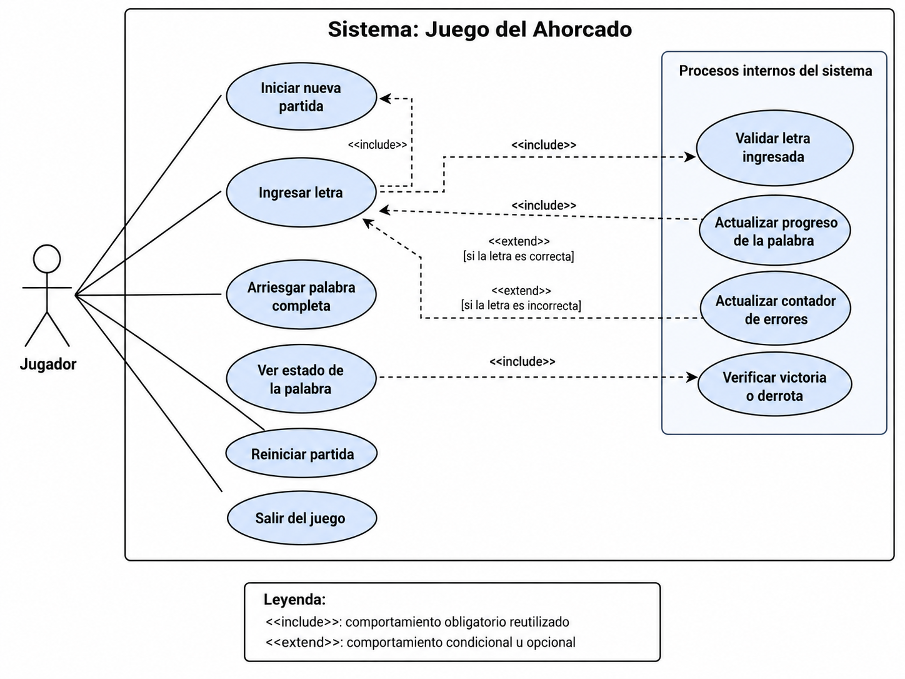
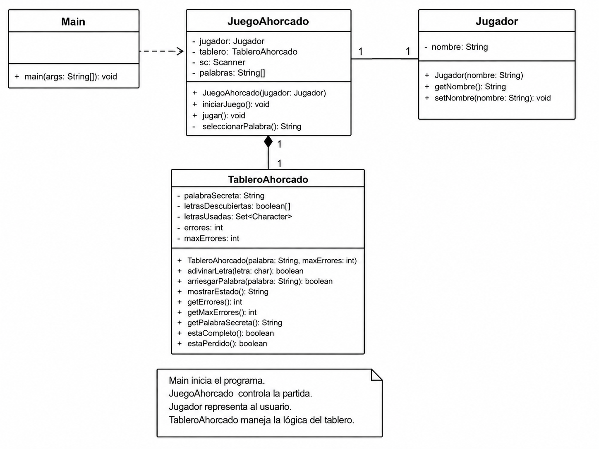

# Juego del Ahorcado

## Descripción

Juego del Ahorcado desarrollado en Java aplicando conceptos de Programación Orientada a Objetos (POO).

El jugador debe descubrir una palabra secreta ingresando letras. Cada letra incorrecta aumenta el número de errores y completa progresivamente la figura del ahorcado. El jugador pierde al alcanzar un máximo de 6 errores.

El programa también permite intentar adivinar la palabra completa, reiniciar la partida o salir del juego.

## Clases

El programa está dividido en cuatro clases principales:

- `Main`: inicia la ejecución del programa.
- `Jugador`: representa al jugador y almacena su nombre.
- `JuegoAhorcado`: controla el desarrollo y las opciones de la partida.
- `TableroAhorcado`: administra la palabra secreta, las letras descubiertas y los errores.

### Diagrama de casos de uso

El siguiente diagrama representa las acciones que puede realizar el jugador y los procesos que ejecuta el sistema durante una partida.

### Diagrama de clases

El siguiente diagrama representa las clases principales del sistema, sus atributos, métodos y relaciones.

## Funcionamiento

Al iniciar el programa, el jugador ingresa su nombre y se genera una palabra secreta.

Durante la partida puede:

1. Ingresar una letra.
2. Arriesgar la palabra completa.
3. Reiniciar la partida.
4. Salir del juego.

Cada error provoca que se agregue una nueva parte a la figura del ahorcado. El jugador gana cuando descubre completamente la palabra y pierde cuando alcanza los 6 errores permitidos.
