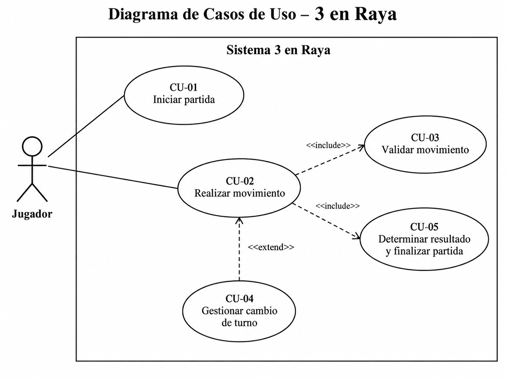

# Microevaluación 4 – 3 en Raya

## Descripción

Prototipo del juego **3 en Raya (Tic-Tac-Toe)** desarrollado en C# utilizando .NET y ejecutado mediante consola.

El proyecto aplica el paradigma de **Diseño Orientado a Objetos**, separando las responsabilidades del sistema en las clases `Jugador`, `Tablero` y `Juego`.

## Tecnologías utilizadas

- C#
- .NET 10
- Visual Studio Code
- Git
- GitHub

## Arquitectura

### Jugador

Representa a cada participante del juego y almacena su nombre y símbolo (`X` u `O`) mediante propiedades de solo lectura con `get;`.

### Tablero

Representa el tablero mediante una matriz bidimensional nativa de C#:

```csharp
char[,]
```

Es responsable de validar posiciones, colocar fichas, mostrar el tablero y detectar victoria o empate.

### Juego

Funciona como controlador principal. Gestiona los jugadores, el tablero, la entrada por consola, los turnos y la finalización de la partida.

### Program

Funciona únicamente como punto de entrada de la aplicación. Crea los jugadores, crea el controlador `Juego` e inicia la partida.

## Diagrama de Clases UML


[Ver diagrama y sintaxis Mermaid](docs/diagrama-clases.md)

## Diagrama de Casos de Uso



[Ver descripción formal de los casos de uso](docs/diagrama-casos-de-uso.md)

## Requerimientos implementados

- Propiedades C# con `get;`.
- Convención PascalCase.
- Matriz bidimensional `char[,]`.
- Entrada mediante `Console.ReadLine()`.
- Salida mediante `Console.WriteLine()`.
- Validación de filas y columnas entre 0 y 2.
- Prevención de sobrescritura de fichas.
- Cambio automático de turnos.
- Detección de victoria horizontal.
- Detección de victoria vertical.
- Detección de victoria diagonal.
- Detección de empate.

## Ejecución

Ubicarse en:

```text
examenes/microevaluacion4
```

y ejecutar:

```bash
dotnet run
```

## Estructura

```text
microevaluacion4/
├── Controladores/
│   └── Juego.cs
├── Modelos/
│   ├── Jugador.cs
│   └── Tablero.cs
├── docs/
│   ├── diagrama-casos-de-uso.md
│   ├── diagrama-casos-de-uso.png
│   ├── diagrama-clases.md
│   └── diagrama-clases.png
├── Microevaluacion4.csproj
├── Program.cs
└── README.md
```
