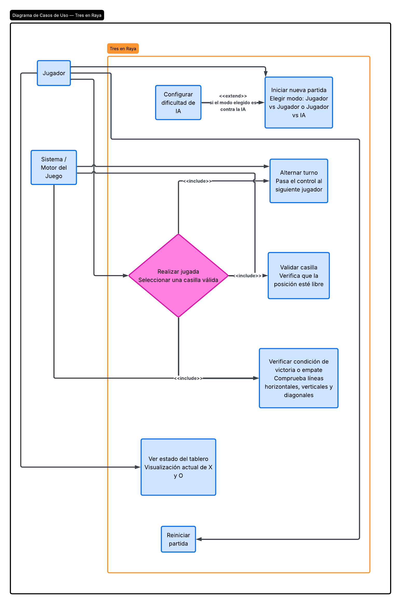
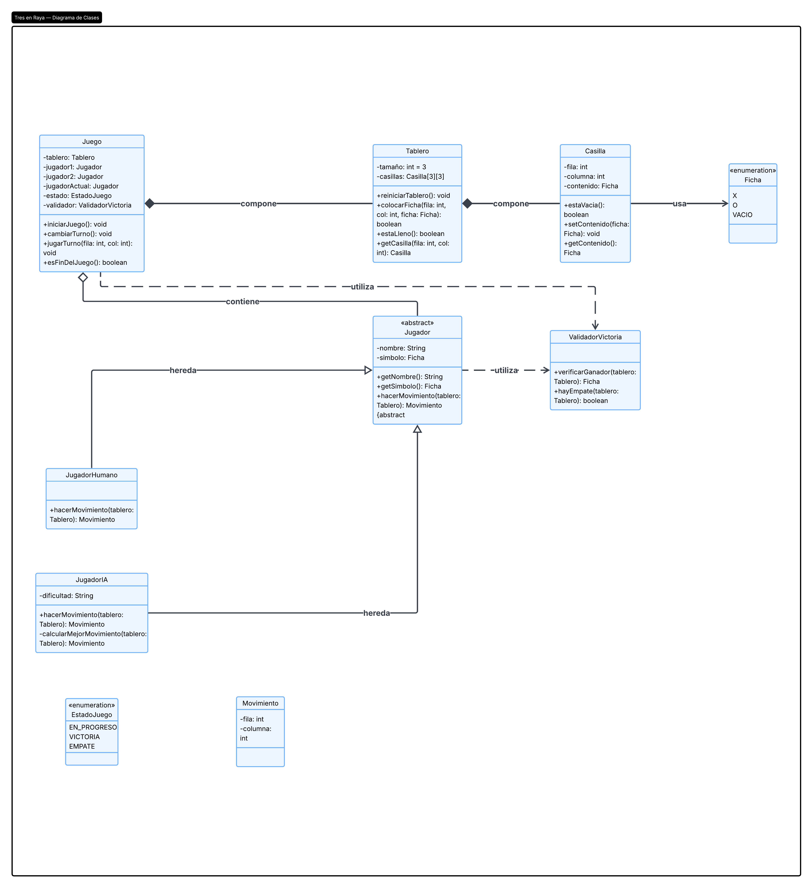

# Práctica 3 en Raya

## Descripción

Juego de 3 en Raya desarrollado en Java utilizando Programación Orientada a Objetos (POO).

El juego permite que dos jugadores jueguen por turnos utilizando los símbolos X y O.

## Diagramas

### Diagrama de casos de uso

### Diagrama de clases

## Clases

* `Main.java`
* `Jugador.java`
* `Tablero.java`
* `Juego.java`

## Ejecución

El juego se ejecuta desde la consola y permite realizar los movimientos de los dos jugadores hasta obtener un ganador o un empate.
