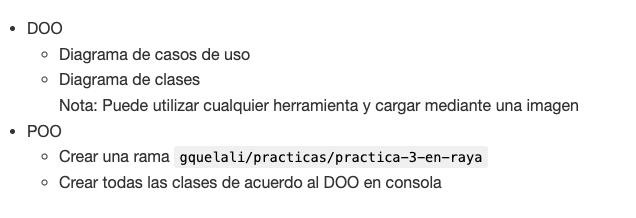
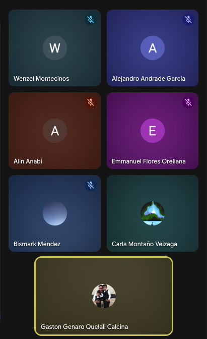

# Realiazar el DOO y la implementación (POO) del juego de 3 en raya

- DOO
  - Diagrama de casos de uso
  - Diagrama de clases
Nota: Puede utilizar cualquier herramienta y cargar mediante una imagen
- POO
  - Crear una rama `gquelali/practicas/practica-3-en-raya`
  - Crear todas las clases de acuerdo al DOO en consola

Ejemplo de carga de imagenes

