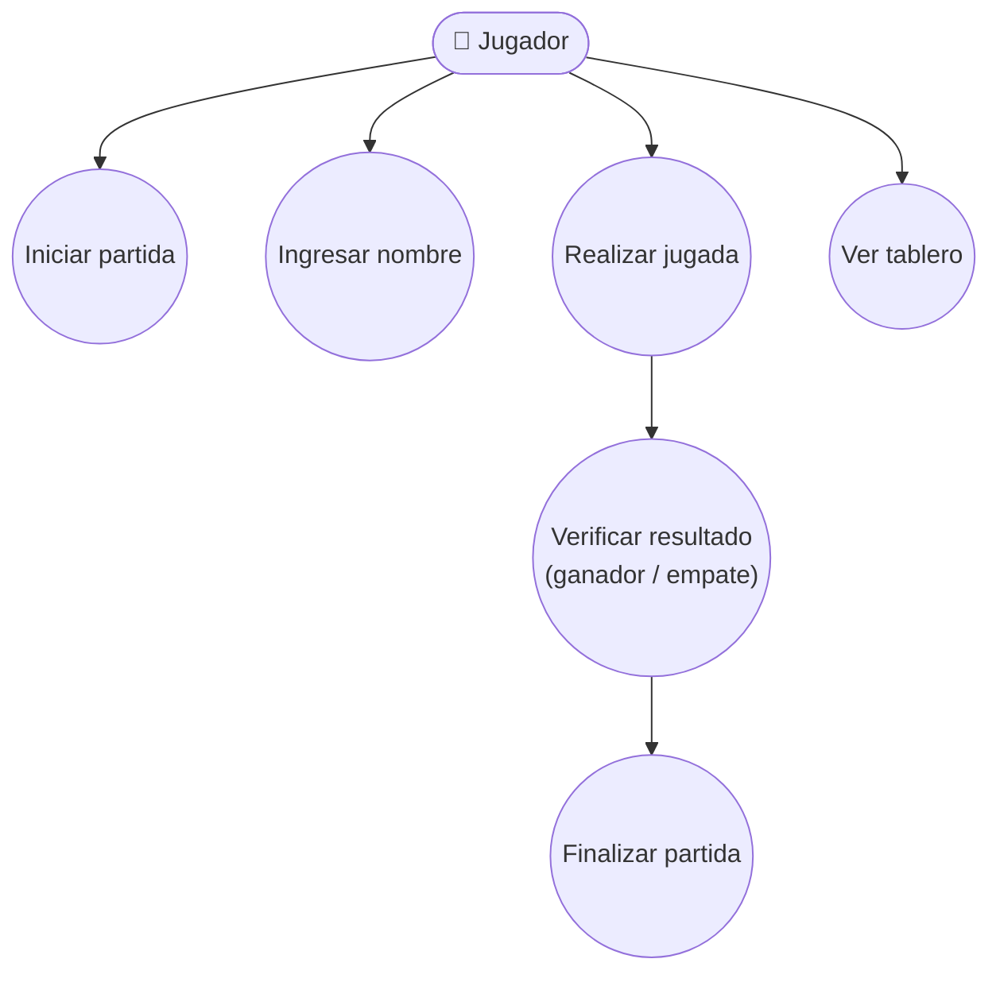
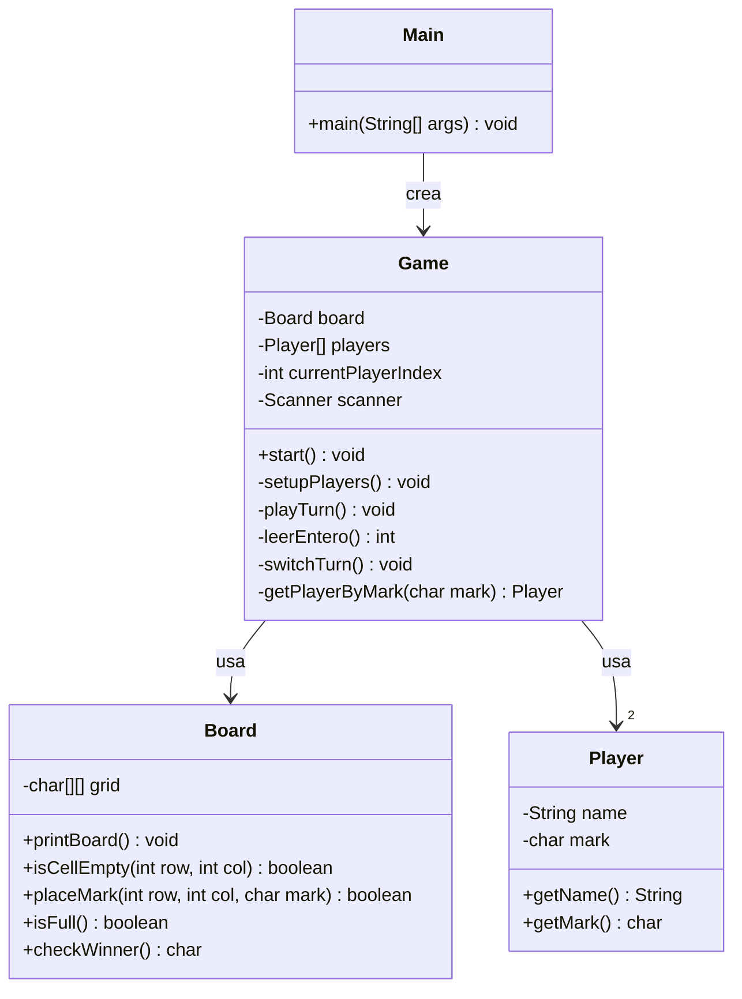

# Tres en Raya (Tic-Tac-Toe) — Java, consola

Juego de tres en raya para 2 jugadores, ejecutado en consola. Proyecto hecho en Java puro (sin dependencias externas).

## Estructura de clases

- `Main`: punto de entrada del programa.
- `Game`: controla el flujo del juego (turnos, entrada del usuario, fin de partida).
- `Board`: representa el tablero 3x3 y su lógica (colocar fichas, verificar ganador, verificar empate).
- `Player`: representa a un jugador (nombre y ficha).

## Cómo ejecutarlo (VS Code)

1. Abre esta carpeta en VS Code (necesitas el JDK instalado y la extensión "Extension Pack for Java").
2. Abre `Main.java` y presiona **Run** (o clic derecho → "Run Java").
3. También puedes hacerlo por terminal:
   ```bash
   javac *.java
   java Main
   ```

## Diagrama de casos de uso



**Actor:** Jugador (aplica tanto para el Jugador 1 como el Jugador 2, ya que ambos usan las mismas funciones por turno).

**Casos de uso:**
- Iniciar partida: arranca el juego y crea el tablero vacío.
- Ingresar nombre: cada jugador escribe su nombre al inicio.
- Realizar jugada: el jugador elige fila y columna para colocar su ficha.
- Ver tablero: se imprime el estado actual del tablero tras cada jugada.
- Verificar resultado: el sistema revisa si hay ganador o empate tras cada jugada.
- Finalizar partida: se anuncia el resultado y termina el programa.

## Diagrama de clases



> Nota: GitHub renderiza estos diagramas automáticamente al ver el `README.md` en el repositorio (no necesitas nada extra). Si tu profesor pide el diagrama como imagen aparte, puedes abrir este archivo en el editor de Mermaid Live (mermaid.live), pegar el bloque correspondiente y exportarlo como PNG.
