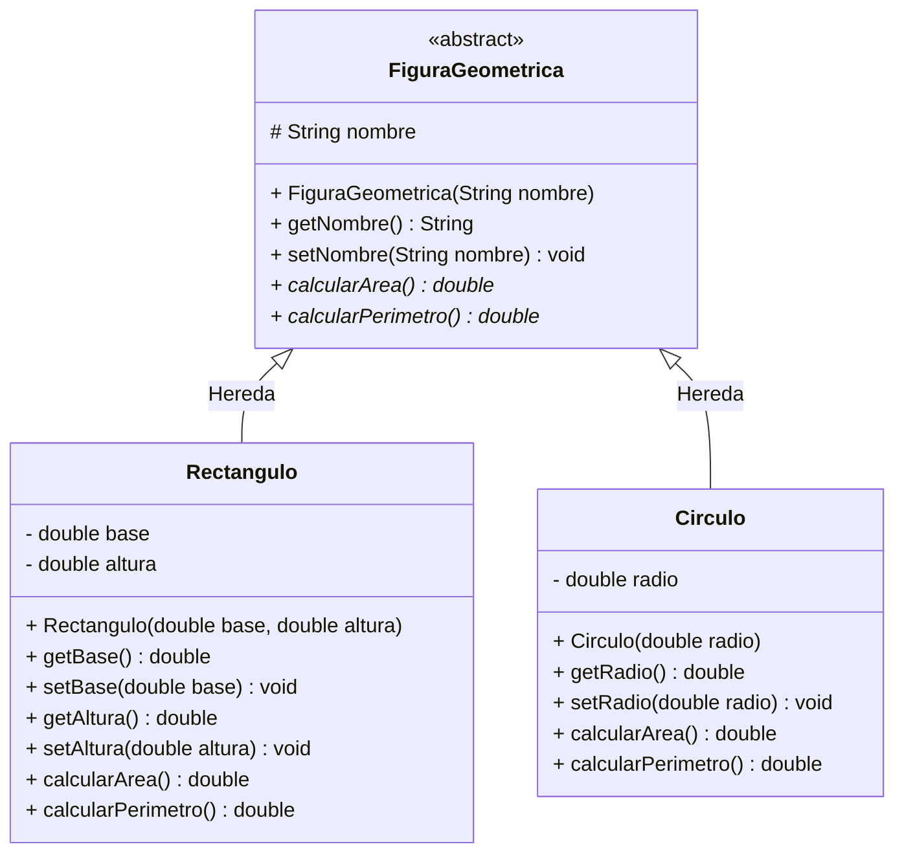

# Proyecto practica-geometria

Aplicación de consola Java que aplica los principios de la Programación Orientada a Objetos (POO) —como **Herencia**, **Abstracción**, **Encapsulamiento** y **Polimorfismo**— para calcular el área y perímetro de distintas figuras geométricas.

---

## 🛠️ Estructura del Proyecto

```text
practica-geometria/
├── src/
│   └── com/
│       └── geometria/
│           ├── model/
│           │   ├── FiguraGeometrica.java  (Clase padre abstracta)
│           │   ├── Rectangulo.java        (Clase hija)
│           │   └── Circulo.java           (Clase hija)
│           └── Main.java                  (Punto de entrada y menú)
└── README.md
```

---

## 📐 Diagrama de Clases (Mermaid)



---

## 📋 Especificación de Clases

### 1. `FiguraGeometrica` (Clase Padre Abstracta)
Define el contrato base para todas las figuras del sistema.

* **Atributos:**
  * `# nombre: String` (Protegido)
* **Métodos:**
  * `+ FiguraGeometrica(String nombre)`: Constructor.
  * `+ calcularArea(): double`: Método abstracto a implementar por las subclases.
  * `+ calcularPerimetro(): double`: Método abstracto a implementar por las subclases.

### 2. `Rectangulo` (Clase Hija)
Representa un rectángulo bidimensional.

* **Atributos Privados:**
  * `- base: double`
  * `- altura: double`
* **Fórmulas:**
  * Área = base * altura
  * Perímetro = 2 * (base + altura)

### 3. `Circulo` (Clase Hija)
Representa un círculo bidimensional.

* **Atributos Privados:**
  * `- radio: double`
* **Fórmulas:**
  * Área = π * radio²
  * Perímetro = 2 * π * radio

---

## 💻 Compilación y Ejecución desde Terminal

### 1. Ubicación
Asegúrate de estar posicionado en la raíz del proyecto (`practica-geometria`).

### 2. Compilar los archivos Java
Compila todos los archivos de origen y coloca los archivos binarios (`.class`) en la carpeta `bin`:

```bash
javac -d bin src/com/geometria/model/*.java src/com/geometria/*.java
```

### 3. Ejecutar la aplicación
Ejecuta la clase principal indicando el classpath:

```bash
java -cp bin com.geometria.Main
```

---

## 🚀 Flujo de Ejecución en Consola (`Main`)

1. El programa despliega un menú interactivo:
   * `1.` Calcular Rectángulo
   * `2.` Calcular Círculo
   * `3.` Salir
2. Solicita al usuario las dimensiones correspondientes (validadas para ser números positivos).
3. Utiliza **Polimorfismo** instanciando las subclases bajo la referencia de `FiguraGeometrica`.
4. Imprime el nombre, área y perímetro calculados.
---

## Conclusiones

1. **Abstracción:** La clase abstracta FiguraGeometrica define el contrato común (calcularArea y calcularPerimetro) sin imponer implementaciones rígidas a nivel padre.
2. **Herencia:** Las clases hijas Rectangulo y Circulo reutilizan la estructura base y extienden sus fórmulas específicas de manera modular.
3. **Encapsulamiento:** Se resguardan los datos internos mediante modificadores de acceso privados y métodos accesores controlados (getters/setters).
4. **Polimorfismo:** Permite manipular diferentes figuras geométricas bajo el tipo común FiguraGeometrica en tiempo de ejecución de forma dinámica.
